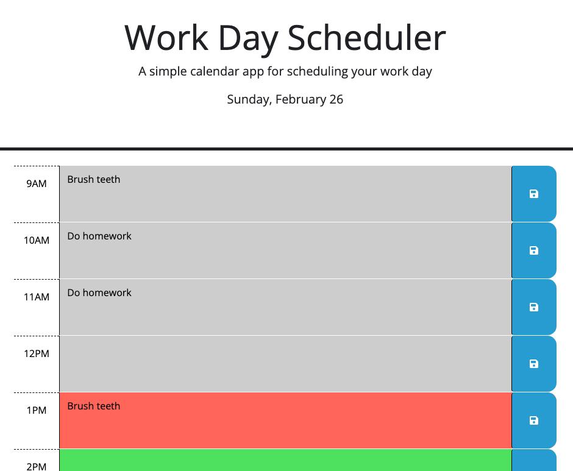

# Work-Day-Scheduler

This is a simple, hourly work day scheduler. It features a text input field designated by the hours 9 to 5. A User can type in the information they would like to reference for each hour. The color of the input field of the current hour is red, as the hour passes the input field color changes to gray and the up coming hours' input fields are green.

The Users text input is also committed to local storage and will persist upon browser refresh.

